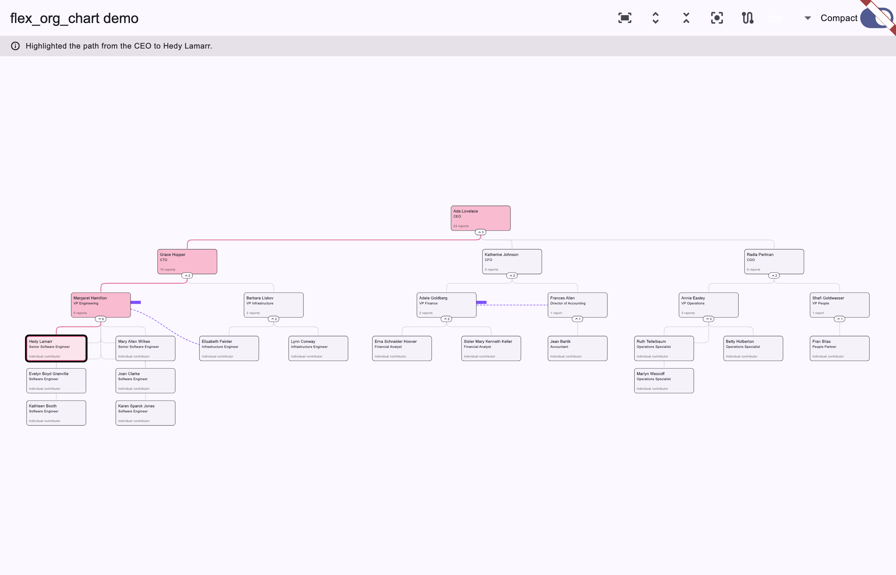

# flex_org_chart

Highly customizable, animated org chart widget for Flutter: pan/zoom, a
flextree-based compact layout for leaf-heavy teams, expand/collapse,
highlighting, and independent connection overlays. Ported from
[d3-org-chart](https://github.com/bumbeishvili/org-chart).



*(Screenshot from `example/` — see [Example](#example) below.)*

## Install

```yaml
dependencies:
  flex_org_chart: ^0.1.0
```

## Quickstart

`OrgChartController` is caller-owned — create and keep it (e.g. as a
`State` field) wherever you own the chart's data, and call `dispose()` on
it yourself when you're done, as the example app does; the `OrgChart`
widget below only observes and drives it.

```dart
import 'package:flutter/material.dart';
import 'package:flex_org_chart/flex_org_chart.dart';

class Employee {
  const Employee(this.id, this.managerId, this.name);
  final String id;
  final String? managerId;
  final String name;
}

final controller = OrgChartController<Employee>(
  data: const [
    Employee('1', null, 'Ada Lovelace'),
    Employee('2', '1', 'Grace Hopper'),
    Employee('3', '1', 'Katherine Johnson'),
  ],
  idOf: (e) => e.id,
  parentIdOf: (e) => e.managerId,
);

// Anywhere in your widget tree:
OrgChart<Employee>(
  controller: controller,
  nodeBuilder: (context, node) => Card(
    child: Center(child: Text(node.data.name)),
  ),
  onNodeTap: (node) => controller.highlightPathToRoot(node.id),
);

// Imperative navigation, from anywhere that holds the controller:
controller.fit();
controller.centerNode('2');
controller.expandAll();
```

## Features

| Feature | flex_org_chart | d3-org-chart |
| --- | :---: | :---: |
| Tree layout (top/bottom/left/right) | done | done |
| Compact mode (leaf-heavy folding) | done | done |
| Pan / pinch-zoom / scroll-zoom | done | done |
| Expand / collapse (single, all, programmatic) | done | done |
| Fit / center-on-node / zoom in/out | done | done |
| Highlight + highlight-path-to-root | done | done |
| Custom node rendering | done (`nodeBuilder`, any widget) | done (HTML template) |
| Custom expand/collapse affordance | done (`expandButtonBuilder`) | done |
| Animated layout transitions | done | done |
| Non-hierarchical connections (dashed, labeled) | done | done |
| Data validation (cycles, missing parents, dup ids) | done (`OrgChartDataException`) | partial (throws generic errors) |
| Drag-and-drop re-parenting | roadmap | done |
| Node editing (add/remove/re-parent via API) | roadmap | done |
| Department bounding boxes (group nodes by subtree) | roadmap | — |
| Image / PDF export | roadmap | done |

Rows marked **roadmap** are **not implemented** in this release — there is no
partial or hidden support for them — and are listed in planned build order.
If your use case depends on one of them, this package isn't ready for it yet.
d3-org-chart's pagination for very large trees is not planned.

## Example

`example/` is a complete demo, not a toy: a 25-person, 4-level org (with one
manager whose 6 direct reports show off compact-mode folding), wired to
every feature above — layout-direction switching, the compact toggle,
fit/expand-all/collapse-all/center/highlight-path actions, tap-to-highlight,
and two connection overlays. Run it with:

```bash
cd example
flutter run -d macos   # or -d chrome, or a connected device
```

## Third-party licenses

This package ports the layout algorithms and API design of
[d3-org-chart](https://github.com/bumbeishvili/org-chart) (MIT) and
[d3-flextree](https://github.com/Klortho/d3-flextree) (WTFPL). See
[THIRD_PARTY_LICENSES.md](THIRD_PARTY_LICENSES.md) for full attribution.

## License

[BSD 3-Clause](LICENSE).
